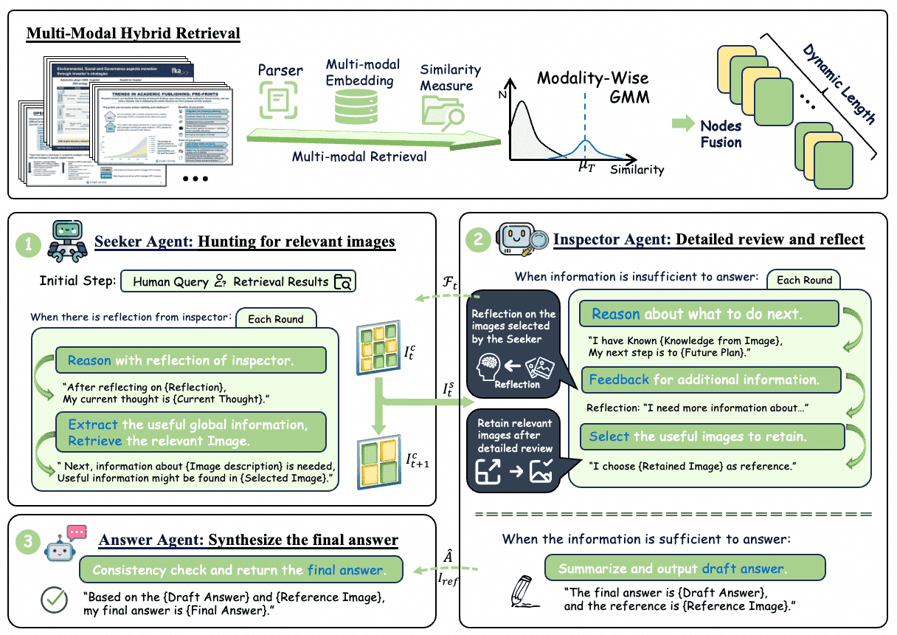
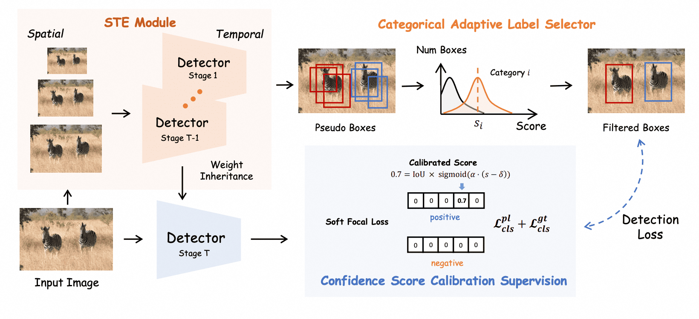
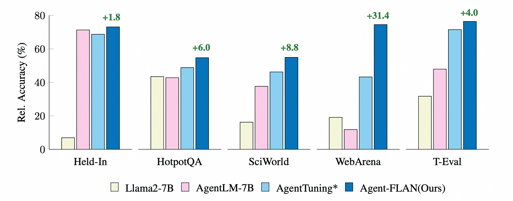








Hi! I’m Qiuchen Wang, a second year graduate student at University of Science and Technology of China. I am co-supervised by Prof. [Feng Zhao](https://en.auto.ustc.edu.cn/2021/0616/c26828a513169/page.htm) and Prof. [Feng Wu](https://scholar.google.com/citations?user=5bInRDEAAAAJ). Previously, I obtained my B.Eng. degree in Electronic Information and Communications of Huazhong University of Science and Technology, under the guidance of Prof. [Xinge You](https://bmal.hust.edu.cn/EN.htm).

My research interest includes Large Language Models, Retrieval-augmented Generation, and Continual Learning. 

<!-- I have published more than 100 papers at the top international AI conferences with total <a href='https://scholar.google.com/citations?user=DhtAFkwAAAAJ'>google scholar citations <strong>260000+</strong></a> (You can also use google scholar badge ). -->

# 🔥 News
- **2025.1**: Two paper got accepted to ICLR 2025
- **2024.7**: We released [MindSearch(思·索)](https://mindsearch.netlify.app/), which is an awesome AI search engine comparable to Perplexity.ai Pro. Welcome to use and provide your feedback!
- **2024.4**: One paper got accepted to ACL 2024
- **2024.3**: We released [Agent-FLAN](https://github.com/InternLM/Agent-FLAN), which explores the construction of high-quality agent corpus for LLMs.

# 📝 Publications 

<!-- vidorag -->

**ViDoRAG: Visual Document Retrieval Augmented Generation via Dynamic Iterative Reasoning Agents**

**Qiuchen Wang**,
Ruixue Ding,
Zehui Chen,
Weiqi Wu,
Shihang Wang,
Pengjun Xie,
Feng Zhao

*Arxiv*

[[**Project**]]()&nbsp;
[[**Paper**]]()&nbsp;
[[**Code**]]()

<!-- vidorag -->

<!-- psedet -->
<!-- 

ICLR 2025

 -->

**PseDet: Revisiting the Power of Pseudo Label in Incremental Object Detection**

**Qiuchen Wang**,
Zehui Chen,
Chenhongyi Yang,
JIaming Liu,
Zhenyu Li,
Feng Zhao

*International Conference on Learning Representations (**ICLR**), 2025*

[[**Project**]]()&nbsp;
[[**Paper**]]()&nbsp;
[[**Code**]]()

<!-- psedet -->

<!-- mindsearch -->

**MindSearch: Mimicking Human Minds Elicits Deep AI Searcher**

Zehui Chen\*, Kuikun Liu\*, **Qiuchen Wang**, Jiangning Liu, Wenwei Zhang, Kai Chen, Feng Zhao

*International Conference on Learning Representations (**ICLR**), 2025*

[[**Project**]](https://mindsearch.netlify.app/)&nbsp;
[[**Paper**]](https://arxiv.org/abs/2407.20183)&nbsp;
[[**Code**]](https://github.com/InternLM/MindSearch)

<!-- mindsearch -->

<!-- agentflan -->

**Agent-FLAN: Designing Data and Methods of Effective Agent Tuning for Large Language Models**

Zehui Chen, Kuikun Liu, **Qiuchen Wang**, Wenwei Zhang, Jiangning Liu, Dahua Lin, Kai Chen, Feng Zhao

*Findings of the Association for Computational Linguistics (**ACL Findings**) , 2024*

[[**Project**]](https://internlm.github.io/Agent-FLAN)&nbsp;
[[**Paper**]](https://arxiv.org/abs/2403.12881)&nbsp;
[[**Code**]](https://github.com/InternLM/Agent-FLAN)

<!-- agentflan -->

# 🎖 Awards
- $1^{st}$ place at VCL2023 Challenge, Multitask Learning for Robustness Track! (**ICCV 2023** Workshop)
- Outstanding Graduates of Huazhong University of Science and Technology, 2023.
- Merit Student of Huazhong University of Science and Technology, 2021, 2022.
- The First Prize of the 12th China Undergraduate Mathematics Competition, 2020.

# 📖 Educations
- *2023.09 - present*, M.E. at University of Science and Technology of China. 
- *2019.09 - 2023.06*, B.E. in Electronic Information and Communications of Huazhong University of Science and Technology. 

<!-- # 💬 Invited Talks
- *2021.06*, Lorem ipsum dolor sit amet, consectetur adipiscing elit. Vivamus ornare aliquet ipsum, ac tempus justo dapibus sit amet. 
- *2021.03*, Lorem ipsum dolor sit amet, consectetur adipiscing elit. Vivamus ornare aliquet ipsum, ac tempus justo dapibus sit amet.  \| [\[video\]](https://github.com/) -->

# 💻 Internships
- *2024.08 - present*, LLM Research Intern, Qwen RAG Group at Alibaba-inc, Hangzhou, China.
- *2023.03 - 2023.06*, Autonomous Driving Intern, iMotion, Suzhou, China.